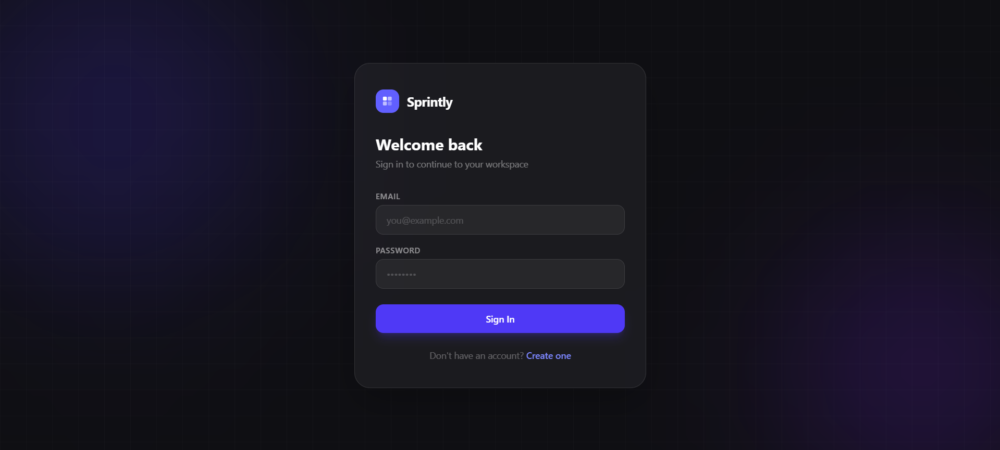
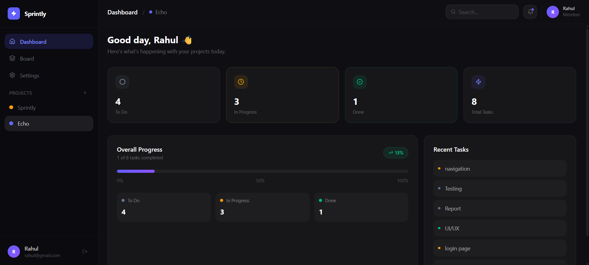
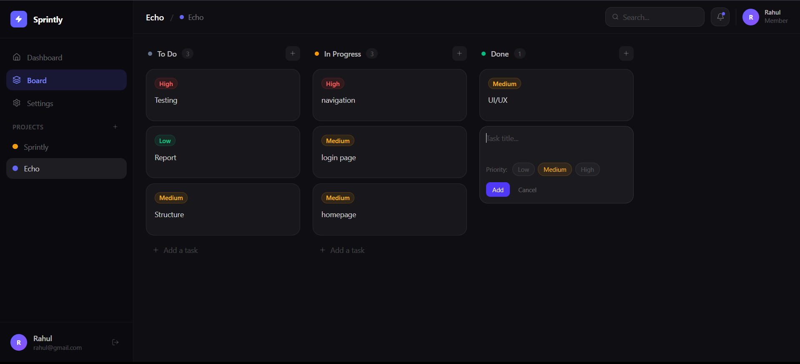
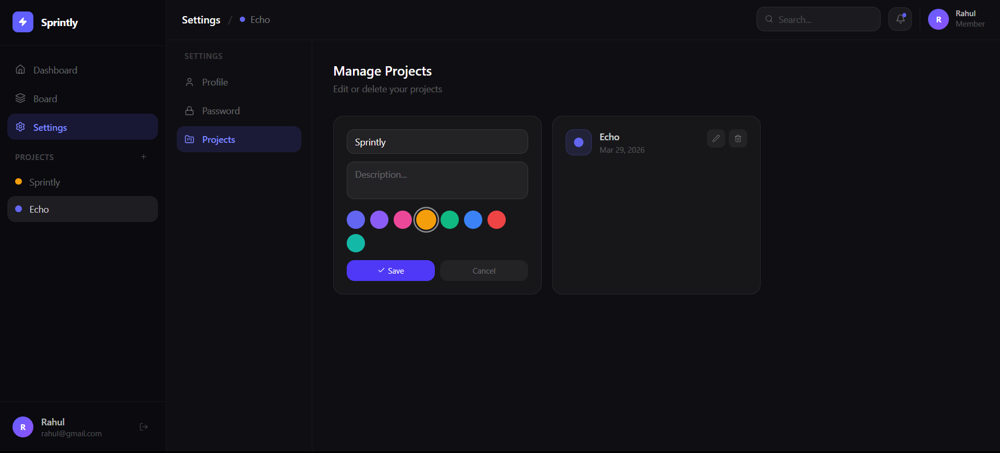
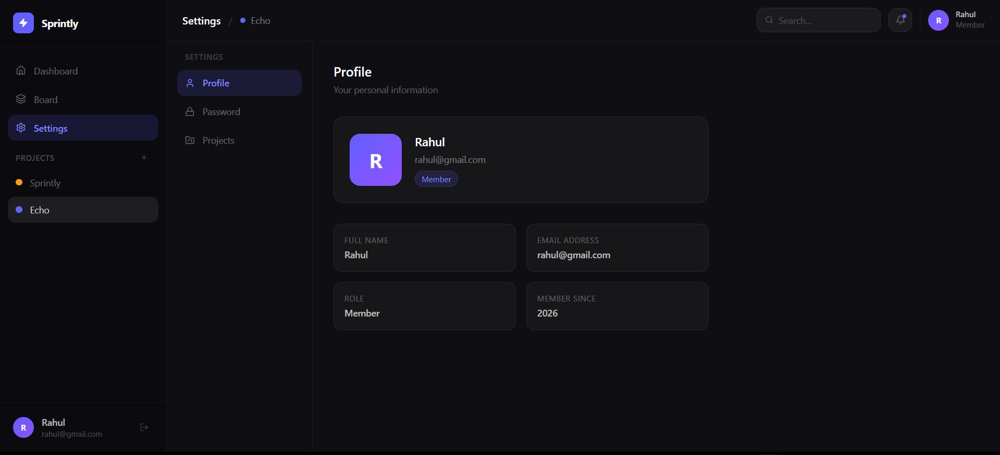

# Sprintly 🚀

A full-stack project management tool inspired by Jira — built with React.js, Node.js, MongoDB Atlas, and Docker.

Live: https://sprintly-8idu.vercel.app/


---

## 📸 Preview

<table align="center">
  <tr>
    <td align="center" width="50%">
      <br/>
      <b>🔐 Login</b>
    </td>
    <td align="center" width="50%">
      <br/>
      <b>📊 Dashboard</b>
    </td>
  </tr>

  <tr>
    <td align="center">
      <br/>
      <b>📋 Kanban Board</b>
    </td>
    <td align="center">
      <br/>
      <b>📁 Manage Projects</b>
    </td>
  </tr>

  <tr>
    <td align="center">
      <br/>
      <b>👤 Profile / Settings</b>
    </td>
    <td></td>
  </tr>
</table>
---

## ✨ Features

- 🔐 **Authentication** — Register & login with JWT tokens
- 📁 **Projects** — Create, edit, delete color-coded projects
- 📋 **Kanban Board** — Drag & drop tasks across To Do / In Progress / Done
- 🎯 **Task Details** — Priority levels, due dates, descriptions
- 💬 **Comments** — Add and delete comments on any task
- 📊 **Dashboard** — Overview of task stats and progress
- ⚙️ **Settings** — Manage profile, change password, edit projects
- 🐳 **Docker** — Fully containerized with Docker Compose
- 🌙 **Dark UI** — Modern dark theme with glassmorphism effects

---

## 🛠 Tech Stack

### Frontend
| Technology | Version | Purpose |
|---|---|---|
| React | v19 | UI framework |
| Vite | v8 | Build tool |
| Tailwind CSS | v4 | Styling |
| Zustand | v5 | State management |
| React Router | v7 | Client-side routing |
| Framer Motion | v12 | Animations |
| DnD Kit | v6 | Drag and drop |
| Axios | v1 | HTTP client |

### Backend
| Technology | Version | Purpose |
|---|---|---|
| Node.js | v20+ | Runtime |
| Express | v5 | Web framework |
| MongoDB Atlas | — | Cloud database |
| Mongoose | v9 | ODM |
| JWT | v9 | Authentication |
| bcryptjs | v3 | Password hashing |
| dotenv | v17 | Environment variables |

### DevOps
| Technology | Purpose |
|---|---|
| Docker | Containerization |
| Docker Compose | Multi-container orchestration |
| nginx | Frontend static file serving |

---

## 📁 Project Structure

```
sprintly/
├── backend/
│   ├── controllers/
│   │   ├── authController.js       # Register, login, change password
│   │   ├── taskController.js       # Task CRUD + comments
│   │   └── projectController.js    # Project CRUD
│   ├── middleware/
│   │   └── auth.js                 # JWT verification middleware
│   ├── models/
│   │   ├── User.js                 # User schema
│   │   ├── Task.js                 # Task schema (with comments)
│   │   └── Project.js              # Project schema
│   ├── routes/
│   │   ├── authRoutes.js           # /api/auth/*
│   │   ├── taskRoutes.js           # /api/tasks/*
│   │   └── projectRoutes.js        # /api/projects/*
│   ├── server.js                   # Express entry point
│   ├── Dockerfile                  # Backend Docker image
│   ├── .env                        # Secrets (never commit)
│   └── package.json
│
├── src/
│   ├── components/
│   │   ├── board/
│   │   │   ├── Board.jsx           # Kanban board container
│   │   │   ├── Column.jsx          # Kanban column with add task
│   │   │   ├── TaskCard.jsx        # Draggable task card
│   │   │   └── TaskModal.jsx       # Full task editor modal
│   │   ├── dashboard/
│   │   │   └── MainContent.jsx     # Stats, progress, recent tasks
│   │   ├── layout/
│   │   │   ├── Sidebar.jsx         # Navigation + project list
│   │   │   └── Topbar.jsx          # Top bar with search + user
│   │   ├── projects/
│   │   │   └── NewProjectModal.jsx # Create project modal
│   │   └── ProtectedRoute.jsx      # Auth guard
│   ├── pages/
│   │   ├── Login.jsx               # Login page
│   │   ├── Register.jsx            # Register page
│   │   ├── Dashboard.jsx           # Dashboard page
│   │   ├── BoardPage.jsx           # Kanban board page
│   │   └── SettingsPage.jsx        # Settings page
│   ├── services/
│   │   └── api.js                  # Axios instance + interceptors
│   ├── store/
│   │   ├── useAuthStore.js         # Auth state (Zustand)
│   │   ├── useTaskStore.js         # Tasks state (Zustand)
│   │   ├── useProjectStore.js      # Projects state (Zustand)
│   │   └── useBoardStore.js        # Board state (Zustand)
│   ├── App.jsx                     # Routes
│   ├── main.jsx                    # React entry point
│   └── index.css                   # Tailwind import
│
├── Dockerfile.frontend             # Frontend Docker image (nginx)
├── docker-compose.yml              # Orchestrates both containers
├── nginx.conf                      # React Router fix for nginx
├── vite.config.js                  # Vite + Tailwind config
└── package.json
```

---

## ⚙️ Setup & Installation

### Prerequisites

- [Node.js v20+](https://nodejs.org)
- [Docker Desktop](https://www.docker.com/products/docker-desktop)
- [MongoDB Atlas](https://www.mongodb.com/atlas) account (free tier works)

---

### 1. Clone the Repository

```bash
git clone https://github.com/theRahulkushwaha/sprintly.git
cd sprintly
```

---

### 2. MongoDB Atlas Setup

1. Go to [https://cloud.mongodb.com](https://cloud.mongodb.com)
2. Create a free cluster
3. Go to **Security → Database Access** → Add a database user
   - Set role to **Atlas Admin**
4. Go to **Security → Network Access** → Add IP Address → **Allow from anywhere** `0.0.0.0/0`
   > Required for Docker to connect
5. Go to your cluster → **Connect → Drivers** → copy the SRV connection string

---

### 3. Configure Environment Variables

Create `backend/.env`:

```env
PORT=5000
MONGO_URI=mongodb+srv://<username>:<password>@cluster0.xxxxx.mongodb.net/sprintly?retryWrites=true&w=majority&appName=Cluster0
JWT_SECRET=your_long_random_secret_here
CLIENT_ORIGIN=http://localhost:3000
```


---

### 4. Run with Docker

```bash
docker-compose up --build
```

| Service | URL |
|---|---|
| Frontend | http://localhost:3000 |
| Backend API | http://localhost:5000 |
| Health Check | http://localhost:5000/health |

To stop:
```bash
docker-compose down
```

---

### 5. Run Locally (Development)

> Use this for development — instant hot reload, no rebuild needed.

**Terminal 1 — Backend:**
```bash
cd backend
npm install
npm run dev
```

**Terminal 2 — Frontend:**
```bash
npm install
npm run dev
```

| Service | URL |
|---|---|
| Frontend | http://localhost:5173 |
| Backend API | http://localhost:5000 |

---

## 👨‍💻 Author

**Rahul Kushwaha**
